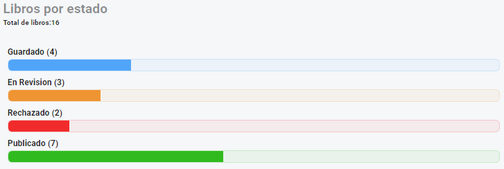
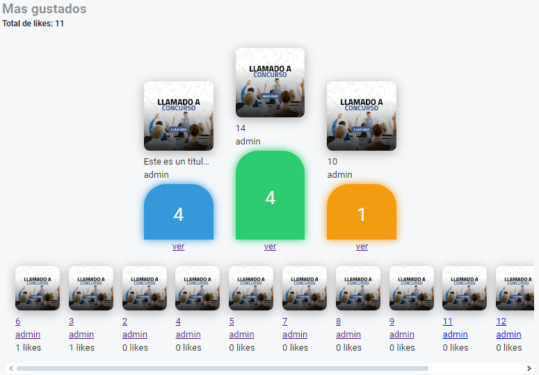
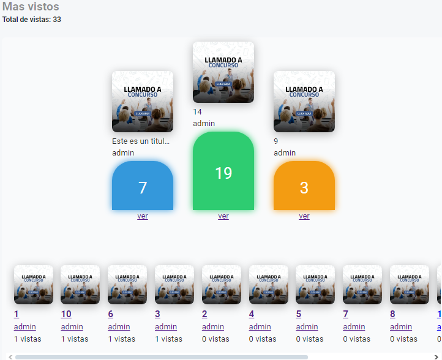

# Gestión de reportes
Esta pagina incluye lo siguientes reportes: 
- [Libros por estado](#libros-por-estado)
- [Libros mas gustados](#mas-gustados)
- [Libros mas vistos](#mas-vistos)

## Libros por estado
Este reporte muestra:
- Total de libros
- Total de libros por estado
- Porcentaje de libros por estado

componente: pages/dashboard/gestionReportes/LibrosPorEstado.tsx

    

## Mas gustados
Este reporte muestra:
- Sumatoria del total de likes de todos los libros
- Podio de los 3 libros mas gustados
- Listado de los demás libros ordenados de forma descendente por likes

componente: pages/dashboard/gestionReportes/RankMasGustados.tsx

    

## Mas Vistos
Este reporte muestra:
- Sumatoria del total de vistas de todos los libros
- Podio de los 3 libros mas vistos
- Listado de los demás libros ordenados de forma descendente por vistas

componente: pages/dashboard/gestionReportes/RankMasVistos.tsx

    

